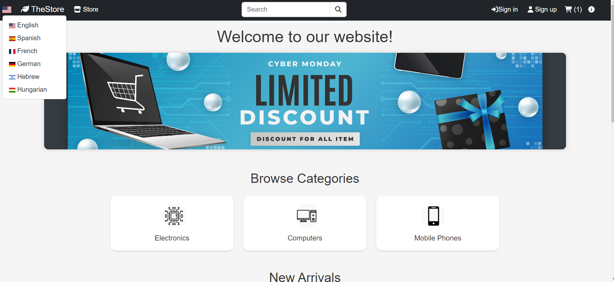
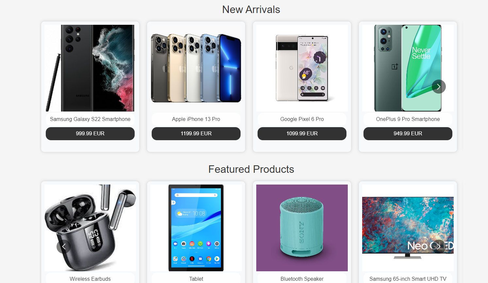
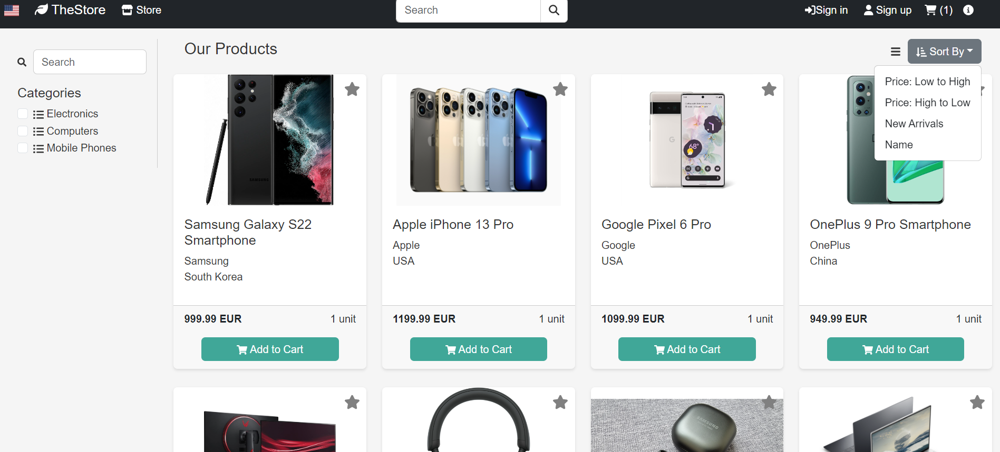
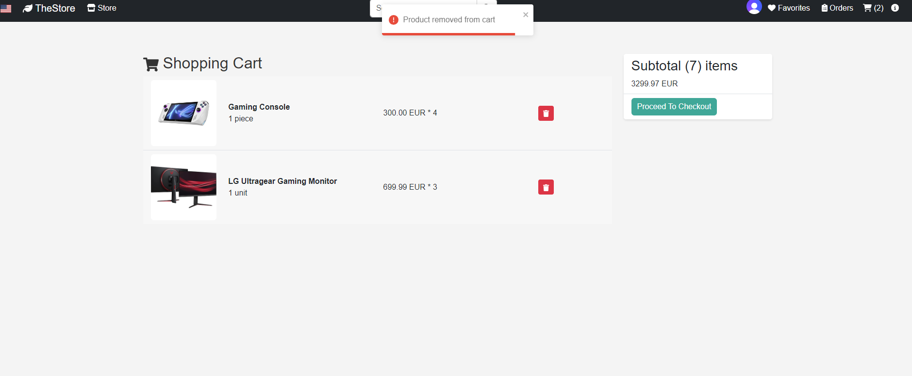
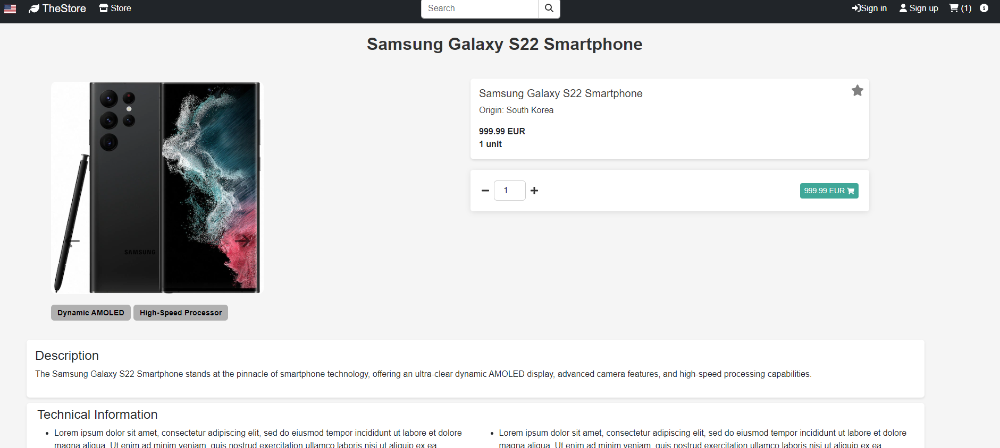

This is my ongoing E Commerce project

Can be found and tested:
https://rad-marzipan-90aff3.netlify.app/

Built with React, Styled-Components, Redux, Bootstrap

HomePage:

StorePage:

CartPage:

Dedicated Item page:

It features include ordering, registering, admin site, searching, favoriting etc.

Backend can be found under:

https://github.com/wsYYnb3/my_project_api

It was written in Node.js, utilizing Express, Sequilize.
